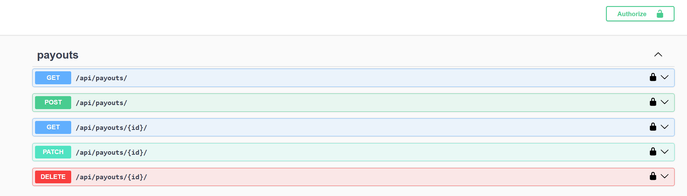

# Backend Developer | Test Task

## Описание задания

Необходимо разработать небольшой REST-сервис для управления заявками на выплату средств. Каждая заявка создаётся через API и должна обрабатываться асинхронно с использованием Celery. Задание небольшое по объёму, но важно продемонстрировать аккуратный, чистый и поддерживаемый код.


## [Установка uv](https://docs.astral.sh/uv/getting-started/installation/)

### Установка зависимостей

Установить postgresql и redis

Установить python пакеиы

```shell
uv sync --all-groups
```

### Запуск приложения
```shell
uv run manage.py runserver
```

### Запуск миграций
ия
```shell
uv run manage.py migrate
```

### Запуск Celery worke
ия
```shell
uv run celery -A django_project worker -l info
```

### Запуск тестов
ия
```shell
uv run manage.py test
```

## Makefile с базовыми командами:


### Запуск всего приложения через docker

```shel
make docker-start
```
### Остановка приложения через docker

```shel
make docker-stop
```

### Запуск сервисов через docker

```shel
make services
```

### Запуск django локально

```shel
make django
```

### Запуск celery локально

```shel
make celery
```

### Создание миграций

```shel
make makemigrations
```

### Применение миграций

```shel
make migrate
```

### Выполнение тестов

```shel
make tests
```

### Выполнение lint локально

```shel
make lint
```

### Swagger

[API](http://127.0.0.1:8000/api/schema/swagger-ui)


## Описание деплоя

Зависит от того где находится сам production server(ОС и т.д.)

1. Установка и настройка компонентов в ручную. (postgresql, redis, python окружение)

2. Сбор и запуск проекта через CI/CD через docker с отдельными конфигами для него.


## Screenshot

